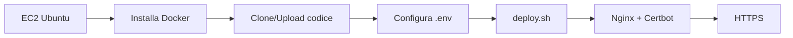

# Guida: Deploy Mixtum su AWS EC2 (Ubuntu)

Questa guida spiega come mettere in produzione il progetto Mixtum su un’istanza **AWS EC2** con **Ubuntu Server**, usando Docker, Nginx e Let’s Encrypt per HTTPS.

---

## Indice

1. [Prerequisiti](#1-prerequisiti)
2. [Creare l’istanza EC2](#2-creare-listanza-ec2)
3. [Primo accesso e preparazione del server](#3-primo-accesso-e-preparazione-del-server)
4. [Deploy del codice](#4-deploy-del-codice)
5. [Configurazione ambiente (.env)](#5-configurazione-ambiente-env)
6. [Avvio stack e SSL](#6-avvio-stack-e-ssl)
7. [Firewall (UFW)](#7-firewall-ufw)
8. [Verifica e comandi utili](#8-verifica-e-comandi-utili)
9. [Avvio automatico](#9-avvio-automatico-opzionale)
10. [Backup e manutenzione](#10-backup-e-manutenzione)
11. [Riferimenti nel repo](#11-riferimenti-nel-repo)

---

## Panoramica del flusso



---

## 1. Prerequisiti

- **Account AWS** con accesso alla console EC2.
- **Dominio** (es. `app.example.com`) per cui puoi creare un record **A** o **CNAME** che punti all’IP dell’istanza (necessario per Let’s Encrypt).
- **Client SSH** sul tuo PC (terminale, PuTTY, ecc.).
- Conoscenza base della shell e, opzionalmente, di Docker.

---

## 2. Creare l’istanza EC2

1. Accedi alla **AWS Console** → **EC2** → **Launch Instance**.

2. **Nome**: scegli un nome descrittivo (es. `mixtum-prod`).

3. **AMI**: seleziona **Ubuntu Server 22.04 LTS** (o 24.04 LTS).

4. **Tipo istanza**: consigliato **t3.small** o superiore (min. 2 GB RAM) per far girare Postgres, Redis, Django, Nginx e Celery.

5. **Key pair**: crea o seleziona una chiave SSH (.pem) e scaricala; ti servirà per accedere via SSH.

6. **Impostazioni di rete**:
   - Crea o seleziona un **Security group** con le seguenti regole in **ingresso**:
     - **SSH (22)** – origine: tuo IP (o range ristretto) per sicurezza.
     - **HTTP (80)** – origine: `0.0.0.0/0`.
     - **HTTPS (443)** – origine: `0.0.0.0/0`.

7. **Storage**: almeno **20–30 GB** (es. 30 GB gp3).

8. Avvia l’istanza.

9. **Elastic IP** (consigliato):
   - EC2 → **Elastic IPs** → **Allocate Elastic IP address** → **Allocate**.
   - **Associate** l’IP all’istanza appena creata.
   - Nel DNS del tuo dominio, crea un record **A** che punti a questo Elastic IP (es. `app.example.com` → `<Elastic-IP>`).

---

## 3. Primo accesso e preparazione del server

### 3.1 Connettersi via SSH

```bash
ssh -i /path/to/launch-key.pem ubuntu@<IP-PUBBLICO-EC2>
```

Sostituisci `<IP-PUBBLICO-EC2>` con l’indirizzo pubblico dell’istanza (o con il dominio, dopo che il DNS è attivo).

### 3.2 Aggiornare il sistema

```bash
sudo apt update && sudo apt upgrade -y
```

### 3.3 Installare Docker

Segui la documentazione ufficiale per Ubuntu: [Install Docker Engine on Ubuntu](https://docs.docker.com/engine/install/ubuntu/). In sintesi:

```bash
sudo apt-get update
sudo apt-get install -y ca-certificates curl
sudo install -m 0755 -d /etc/apt/keyrings
sudo curl -fsSL https://download.docker.com/linux/ubuntu/gpg -o /etc/apt/keyrings/docker.asc
sudo chmod a+r /etc/apt/keyrings/docker.asc

echo "deb [arch=$(dpkg --print-architecture) signed-by=/etc/apt/keyrings/docker.asc] https://download.docker.com/linux/ubuntu $(. /etc/os-release && echo "$VERSION_CODENAME") stable" | sudo tee /etc/apt/sources.list.d/docker.list > /dev/null

sudo apt-get update
sudo apt-get install -y docker-ce docker-ce-cli containerd.io docker-buildx-plugin docker-compose-plugin
```

### 3.4 Permessi Docker per l’utente

```bash
sudo usermod -aG docker $USER
```

Poi esci e riconnettiti via SSH (o apri una nuova sessione) così il gruppo `docker` viene applicato.

### 3.5 Verificare Docker e Docker Compose

```bash
docker --version
docker compose version
```

### 3.6 (Opzionale) Installare Git

Se deployi clonando il repository:

```bash
sudo apt install -y git
```

---

## 4. Deploy del codice

### Opzione A: clone del repository

```bash
cd /home/ubuntu
git clone <URL-DEL-REPO> mixtum-02
cd mixtum-02
```

Sostituisci `<URL-DEL-REPO>` con l’URL del tuo repo (HTTPS o SSH).

### Opzione B: trasferimento da locale (rsync)

Sul tuo PC, dalla cartella del progetto:

```bash
rsync -avz --exclude '.git' --exclude '__pycache__' --exclude '.env' --exclude '*.pyc' \
  ./ ubuntu@<IP-PUBBLICO-EC2>:/home/ubuntu/mixtum-02/
```

Poi copia manualmente il file `.env` sul server (es. con `scp`) dopo averlo preparato come descritto sotto.

### Verifica file necessari

Sulla macchina EC2, nella root del progetto devono essere presenti almeno:

- `Dockerfile`
- `docker/` (con `docker-compose.yml`, `docker-compose.prod.yml`)
- `nginx/` (con `init.sh`, `ssl-watch.sh`, template `.conf.template`)
- `certbot/` (con `entrypoint.sh`)
- `scripts/entrypoint.sh`, `scripts/deploy.sh`
- `mixtum_core/`, `base_modules/`, `requirements.txt`

---

## 5. Configurazione ambiente (.env)

Nella root del progetto sull’EC2:

```bash
cd /home/ubuntu/mixtum-02
cp .env.example .env
nano .env   # oppure vim .env
```

Se `.env.example` non esiste, crea un file `.env` con le variabili sotto.

### Variabili obbligatorie per produzione

| Variabile | Descrizione | Esempio |
|-----------|-------------|---------|
| `SERVER_NAME` | Dominio pubblico dell’app (per Nginx e Certbot) | `app.example.com` |
| `CERTBOT_EMAIL` | Email per Let’s Encrypt | `admin@example.com` |
| `SECRET_KEY` | Chiave segreta Django (genera una nuova) | vedi sotto |
| `POSTGRES_DB` | Nome database | `mixtumdb` |
| `POSTGRES_USER` | Utente Postgres | `mixtumuser` |
| `POSTGRES_PASSWORD` | Password Postgres (forte) | stringa sicura |
| `POSTGRES_HOST` | Host del DB (nome servizio Docker) | `db` |
| `POSTGRES_PORT` | Porta Postgres | `5432` |
| `SETTINGS_ENV` | Ambiente Django | `prod` |
| `DEBUG` | Debug Django | `0` |
| `ALLOWED_HOSTS` | Host consentiti (include `SERVER_NAME`) | `app.example.com,localhost` |
| `CSRF_TRUSTED_ORIGINS` | Origini CSRF (HTTPS) | `https://app.example.com` |
| `CORS_ALLOWED_ORIGINS` | Origini CORS (frontend se usato) | `https://app.example.com` |

### Generare SECRET_KEY

Sul server:

```bash
openssl rand -base64 48
```

Incolla l’output come valore di `SECRET_KEY` nel `.env`.

### Altre variabili utili

- **Celery/Redis**: `CELERY_BROKER_URL=redis://redis:6379/0`, `CELERY_RESULT_BACKEND=django-db`
- **Email**: `EMAIL_HOST`, `EMAIL_PORT`, `EMAIL_HOST_USER`, `EMAIL_HOST_PASSWORD`, `DEFAULT_FROM_EMAIL`
- **AWS S3** (se usi storage S3): `USE_S3`, `AWS_S3_ACCESS_KEY_ID`, `AWS_S3_SECRET_ACCESS_KEY`, `AWS_STORAGE_BUCKET_NAME`, `AWS_S3_REGION_NAME`

Non committare mai il file `.env` nel repository; contiene segreti.

---

## 6. Avvio stack e SSL

Tutti i comandi vanno eseguiti dalla **root del progetto** (dove si trovano `Makefile` e `.env`):

```bash
cd /home/ubuntu/mixtum-02
```

### 6.1 Permessi agli script

```bash
chmod +x scripts/entrypoint.sh scripts/deploy.sh
chmod +x nginx/init.sh nginx/ssl-watch.sh certbot/entrypoint.sh
```

### 6.2 Verificare il DNS

Prima di richiedere il certificato SSL, il dominio in `SERVER_NAME` deve puntare all’IP dell’EC2 (Elastic IP). Verifica con:

```bash
dig +short <tuo-dominio>
# oppure
nslookup <tuo-dominio>
```

L’IP restituito deve essere quello della tua istanza.

### 6.3 Deploy con SSL (consigliato per produzione)

Lo script `deploy.sh` avvia lo stack, attende Nginx su porta 80, rilascia o aggiorna il certificato Let’s Encrypt e avvia il loop di rinnovo:

```bash
./scripts/deploy.sh
```

Per usare la **console SPA** (frontend Angular) invece della sola API:

```bash
DEPLOY_PROFILE=frontend ./scripts/deploy.sh
```

In caso di errore per `SERVER_NAME` o `CERTBOT_EMAIL`, controlla che siano impostati nel `.env`.

### 6.4 Solo HTTP (solo per test)

Se vuoi avviare senza SSL (solo per prove, non esporre in produzione):

```bash
docker compose -p mixtum-02 --env-file .env \
  -f docker/docker-compose.yml -f docker/docker-compose.prod.yml \
  --profile backend up -d --build
```

Il profilo `backend` include Nginx (API). Per includere anche la console frontend usa `--profile frontend`. In produzione è comunque consigliato usare `./scripts/deploy.sh` per avere HTTPS e rinnovo automatico dei certificati.

---

## 7. Firewall (UFW)

Abilita il firewall e apri solo le porte necessarie:

```bash
sudo ufw allow 22/tcp
sudo ufw allow 80/tcp
sudo ufw allow 443/tcp
sudo ufw enable
sudo ufw status
```

Rispondi `y` se richiesto. Controlla che 22, 80 e 443 risultino `ALLOW`.

---

## 8. Verifica e comandi utili

### Stato dei container

```bash
docker compose -f docker/docker-compose.yml -f docker/docker-compose.prod.yml --profile backend ps
```

### Log dei servizi

```bash
docker compose -f docker/docker-compose.yml -f docker/docker-compose.prod.yml logs -f web worker
```

Per Nginx e Certbot:

```bash
docker compose -f docker/docker-compose.yml -f docker/docker-compose.prod.yml logs -f nginx certbot
```

### Migrazioni Django

Dopo aver avviato lo stack:

```bash
docker compose -f docker/docker-compose.yml -f docker/docker-compose.prod.yml --profile backend exec web python manage.py migrate --noinput
```

### Riavvio servizi applicativi

```bash
docker compose -f docker/docker-compose.yml -f docker/docker-compose.prod.yml restart web worker beat
```

Se modifichi la configurazione di Nginx o dei certificati, puoi riavviare anche il servizio nginx (o nginx_console se usi il profilo frontend).

---

## 9. Avvio automatico (opzionale)

I servizi nei file Docker Compose usano `restart: unless-stopped`, quindi Docker (avviato da systemd) riavvierà i container dopo un reboot della macchina.

Se preferisci un unit systemd esplicito che avvii lo stack alla boot, puoi creare ad esempio:

**`/etc/systemd/system/mixtum.service`**:

```ini
[Unit]
Description=Mixtum Docker Compose
Requires=docker.service
After=docker.service

[Service]
Type=oneshot
RemainAfterExit=yes
WorkingDirectory=/home/ubuntu/mixtum-02
ExecStart=/usr/bin/docker compose -f docker/docker-compose.yml -f docker/docker-compose.prod.yml --profile backend up -d
ExecStop=/usr/bin/docker compose -f docker/docker-compose.yml -f docker/docker-compose.prod.yml --profile backend down
User=ubuntu

[Install]
WantedBy=multi-user.target
```

Poi:

```bash
sudo systemctl daemon-reload
sudo systemctl enable mixtum
```

Per produzione con SSL è comunque possibile eseguire una sola volta `./scripts/deploy.sh` dopo il reboot (i container si riavviano già da Docker); il servizio systemd è opzionale.

---

## 10. Backup e manutenzione

### Backup database PostgreSQL

Leggi le credenziali dal `.env` (`POSTGRES_USER`, `POSTGRES_DB`) ed esegui:

```bash
docker compose -f docker/docker-compose.yml -f docker/docker-compose.prod.yml exec -T db \
  pg_dump -U mixtumuser mixtumdb > backup_$(date +%Y%m%d_%H%M%S).sql
```

Adatta utente e nome DB se diversi.

### Backup certificati Let’s Encrypt

La cartella `letsencrypt_data` contiene i certificati. Puoi copiarla periodicamente su un altro host (es. con `rsync` o `scp`) per avere una copia in caso di ripristino.

### Aggiornamento applicazione

1. Aggiorna il codice (es. `git pull` o `rsync`).
2. Ricostruisci e riavvia:

   ```bash
   cd /home/ubuntu/mixtum-02
   docker compose -f docker/docker-compose.yml -f docker/docker-compose.prod.yml --profile backend build --no-cache web worker beat
   docker compose -f docker/docker-compose.yml -f docker/docker-compose.prod.yml --profile backend up -d
   ```

3. Esegui le migrazioni:

   ```bash
   docker compose -f docker/docker-compose.yml -f docker/docker-compose.prod.yml --profile backend exec web python manage.py migrate --noinput
   ```

---

## 11. Riferimenti nel repo

- **Makefile**: target `prod` (avvio produzione senza profilo; per Nginx usare `--profile backend` o `deploy.sh`).
- **scripts/deploy.sh**: deploy completo con build, avvio stack, rilascio/rinnovo certificato Let’s Encrypt e avvio Certbot.
- **docker/docker-compose.yml**: definizione servizi (web, worker, beat, db, redis, nginx con profilo).
- **docker/docker-compose.prod.yml**: override produzione (Nginx, Certbot, volumi SSL).
- **docs/skills/mixtum-architecture-overview.md**: architettura generale del progetto Mixtum.

---

Fine della guida. Per problemi specifici (log, errori Certbot, Nginx) controllare i log dei container indicati nella sezione 8.
