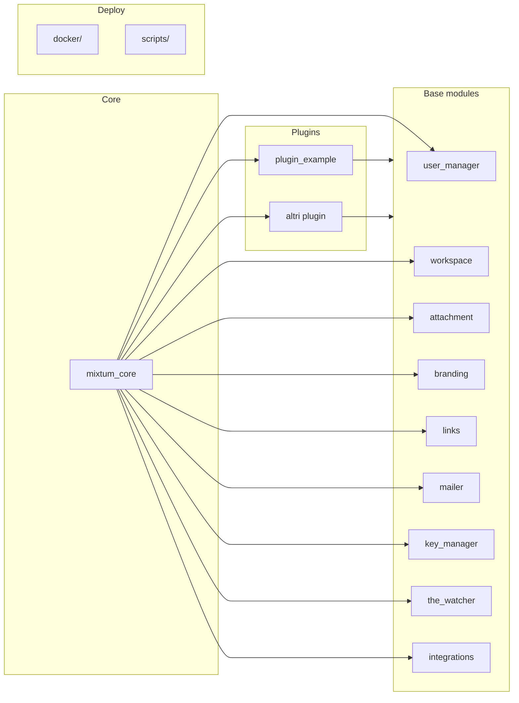

# Struttura di Mixtum

Questa guida descrive come è organizzato il progetto Mixtum: dove si trova ogni parte e come i livelli si relazionano tra loro. È pensata per sviluppatori che devono orientarsi nel codebase o estenderlo.

Per i dettagli architetturali e le regole formali (anche per LLM) si veda [docs/skills/mixtum-architecture-overview.md](skills/mixtum-architecture-overview.md).

---

## Cos’è Mixtum

Mixtum è un **backend Django** che separa la logica in due macro-categorie:

- **Base modules** — blocchi riutilizzabili (utenti, workspace, email, integrazioni, ecc.).
- **Plugins** — funzionalità specifiche del prodotto (ticket, progetti, ecc.) che usano solo i base modules.

Il **core** Django (settings, URL root, middleware) sta in `mixtum_core/` e non contiene business logic; serve solo a configurare e collegare il resto.

---

## Schema ad alto livello

**Regola fondamentale**: i **plugin** possono importare solo da `base_modules`, Django e DRF. **Non** possono importare da altri plugin. I **base modules** non dipendono da nessun plugin.

---

## Cartelle principali

| Cartella | Ruolo |
|----------|--------|
| **`mixtum_core/`** | Progetto Django: `settings/` (base, auth, env), `urls.py` (routing sotto `/api/...`), middleware globale. Nessuna business logic qui. |
| **`base_modules/`** | Moduli condivisi: `user_manager`, `workspace`, `attachment`, `branding`, `links`, `mailer`, `key_manager`, `the_watcher`, `integrations` (messaging, notifications, automation, ai). |
| **`plugins/`** | Estensioni feature (es. `plugin_example`). Ogni plugin è un’app Django che dipende solo da base_modules. |
| **`docker/`** | File Docker Compose: `docker-compose.yml` (base), `docker-compose.local.yml` (porte/volumi sviluppo), `docker-compose.prod.yml` (produzione), `docker-compose.override.yml` (override locale). |
| **`scripts/`** | `setup.sh` (primo avvio locale), `deploy.sh` (deploy produzione con SSL), `entrypoint.sh` e altri script di supporto. |
| **`docs/`** | Documentazione progetto. In `docs/skills/` ci sono gli standard e gli skill per sviluppatori e LLM. |

---

## Come le app sono esposte

1. **Registrazione**: ogni base module e ogni plugin è elencato in `INSTALLED_APPS` in `mixtum_core/settings/base.py`.
2. **URL**: le app che espongono API sono incluse in `mixtum_core/urls.py` sotto prefissi `/api/...` (es. `/api/v1/users/`, `/api/workspace/`, `/api/plugin-example/`). Ogni app ha il proprio `urls.py` incluso con `path(..., include(...))`.

Per aggiungere un nuovo plugin o modulo con API:

- Aggiungere l’app in `INSTALLED_APPS`.
- Aggiungere un `path('api/<nome>/', include(...))` in `mixtum_core/urls.py`.

---

## Dipendenze e confini

- **Plugin → base_modules**: consentito (e necessario). I plugin usano `User`, `Workspace`, mailer, attachment, ecc.
- **Plugin → plugin**: **vietato**. Per far comunicare due plugin usare Django signals o passare oggetti già risolti (es. dal view) ai servizi.
- **Base modules → plugin**: **vietato**. I base modules sono indipendenti dai plugin.

Per il quadro completo e le regole formali: [docs/skills/mixtum-architecture-overview.md](skills/mixtum-architecture-overview.md).
